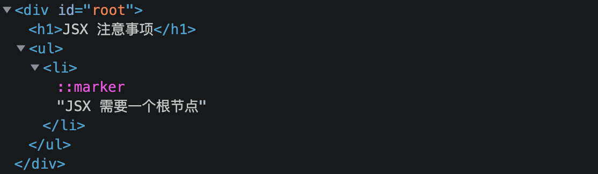

# 练习 002：JSX

## 一. 准备工作

1. 新建项目

   ```bash
   npx create-react-app e-002-jsx
   ```

2. 调整目录结构

   ```txt
   .
   ├── README.md
   ├── package.json
   ├── public
   │   └── index.html
   ├── src
   │   └── index.js
   └── yarn.lock
   ```

## 二. JSX 快速体验

- 概念：JSX 是 JavaScript XML 的缩写，是 JavaScript 的一个语法扩展，如下代码所示：

  ```js
  const element = <h1>Hello, world!</h1>;
  ```

- 作用：允许我们在 React 中使用**类 HTML 语法**创建元素，提高开发效率
- 提示：JSX 不是标准的 JavaScript 语法，需要使用脚手架中内置的 `@babel/plugin-transform-react-jsx` 包解析

### 练习 1：快速体验

#### A. 目标：创建一个元素

使用 JSX，在页面中创建以下结构：

```html
<ul className='nav'>
   <li>手机</li>
   <li>笔记本</li>
   <li>电视</li>
</ul>
```

#### B. 步骤：创建一个元素

1. 导包（略）

2. 创建元素

   ```js
   const nav = <ul className='nav'>
     <li>手机</li>
     <li>笔记本</li>
     <li>电视</li>
   </ul>
   ```

3. 渲染元素（略）

#### C. 「快速体验」问与答

1. 问题一：以下两段代码你更喜欢哪个？

   ```js
   const nav = React.createElement('ul', { className: 'nav' }, [
     React.createElement('li', null, '手机'),
     React.createElement('li', null, '笔记本'),
     React.createElement('li', null, '电视'),
   ])
   ```

   ```js
   const nav = <ul className='nav'>
     <li>手机</li>
     <li>笔记本</li>
     <li>电视</li>
   </ul>
   ```

2. 问题二：在 JSX 中给元素指定**类名**，使用的是 `className` 还是 `class`？
   1. `className`
   2. 因为 `class` 是 JavaScript 的一个关键字

3. 问题三：JSX 是标准的 JavaScript 语法，还是 JavaScript 的一个语法扩展？能直接使用吗？
   1. 是 JavaScript 的一个语法扩展
   2. 浏览器不能直接处理 JSX，需要通过 `babel` 的转换器将 JSX 转换成 `createElement` 的语法
      - **扩展**：访问 [https://babeljs.io/repl](https://babeljs.io/repl) 体验 JSX 转换

### 练习 2：JSX 注意事项

#### A. 目标：知道编写 JSX 的几个注意事项

1. JSX 必须要有一个根节点
   1. 技巧：可以使用 `<></>` 包裹多个平级元素，并且在渲染时不会渲染这个元素
2. 在 JSX 中标签必须关闭，也就是：单标签的元素需要使用 `/>` 结束
3. 如果 JSX 有多行，推荐使用 `()` 包裹，可以防止出现自动插入分号的 BUG

#### B. 步骤：JSX 注意事项

1. 编写如下代码，创建两个平级元素，vscode 会有错误提示：**JSX 表达式必须具有一个父元素。**

   ```js
   const element =
     <h1>JSX 注意事项</h1>
     <ul>
       <li>JSX 需要一个根节点</li>
     </ul>
   ```

2. 使用 `<></>` 空标签包裹，并且渲染元素，修改后的代码如下：

   ```js
   const element =
     <>
       <h1>JSX 注意事项</h1>
       <ul>
         <li>JSX 需要一个根节点</li>
       </ul>
     </>

   ReactDOM.render(element, document.getElementById('root'))
   ```

3. 打开浏览器的元素检查，会发现 `<></>` 节点并不会被渲染，如下图所示：

   

4. 在 `ul` 下方增加一个 `hr` 标签，可以分别尝试以下三种方式，观察哪一种方式会出错：
   1. `<hr></hr>`
   2. `<hr />`
   3. `<hr>`

5. 使用 `()` 包裹以上代码，最终完成的代码如下：

   ```js
   import ReactDOM from 'react-dom'
   
   const element = (
     <>
       <h1>JSX 注意事项</h1>
       <ul>
         <li>JSX 需要一个根节点</li>
       </ul>
       <hr></hr>
     </>
   )
   
   ReactDOM.render(element, document.getElementById('root'))
   ```

#### C. 「JSX 注意事项」问与答

1. 问题一：JSX 中使用 `<></>` 包裹元素会被渲染吗？
   - 不会

2. 问题二：JSX 中能使用单标签吗？
   - 不能
   - 单标签需要使用 `/>` 结束

3. 问题三：使用 `()` 包裹多行 JSX 可以防止什么问题？
   - 防止出现自动插入分号的 BUG，在开发中推荐使用
